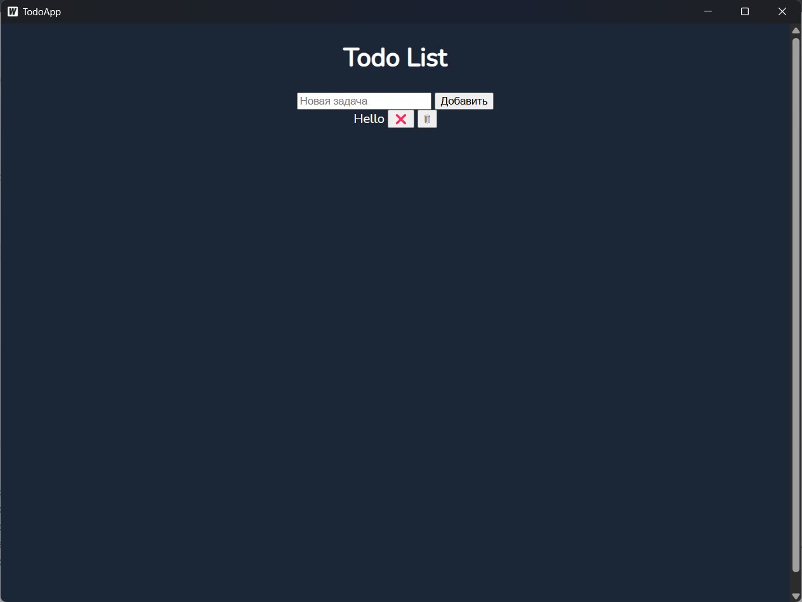
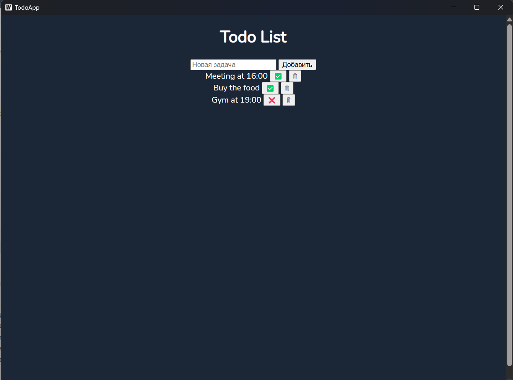

## About

This is simple to do list project with Wails (Go & JS) + sqlite as db

You can create tasks, delete and mark as completed

## Live Development

To run the app
`wails dev`

## Building

To build a redistributable, production mode package, use `wails build`.

